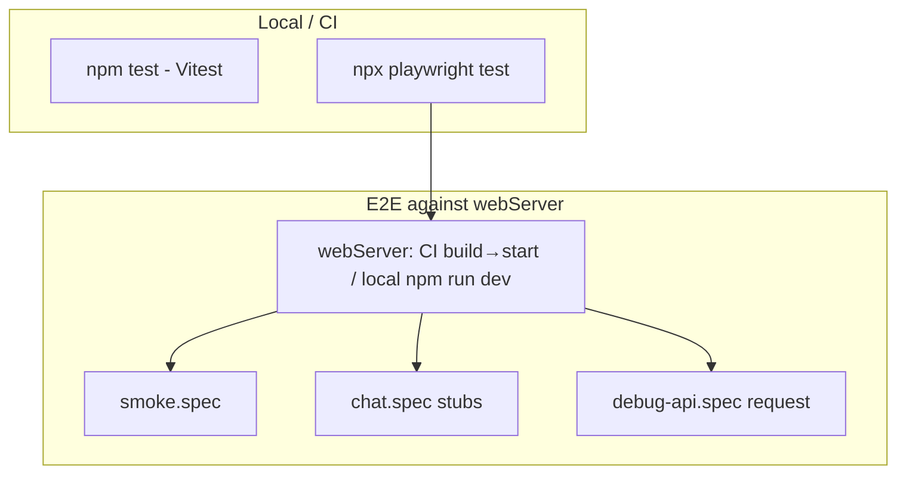

# feat: Add Playwright minimum viable test suite

## Goal Capsule

Add Playwright and a smallest high-value E2E suite for this portfolio: page smoke, stubbed AI-chat happy path, client-filter risk, unauthenticated debug-API risk checks, and GitHub Actions CI. Prefer maximum risk mitigation over coverage volume — no exhaustive UI or Vitest expansion.

**Authority:** Confirmed scoping (stubs, CI in-scope, debug endpoints in risk checks) > this plan > local conventions in `.cursor/artifacts/ARCHITECTURE.md`.

**Stop when:** Chromium E2E suite is green locally and in CI (CI against production `build`/`start`; local may use `npm run dev` with `reuseExistingServer`), chat never calls a live LLM, and Definition of Done checks pass.

---

## Product Contract

### Summary

Install Playwright with an `e2e/` suite coexisting with Vitest. Cover smoke (home + one secondary route + chat shell), stubbed chat send/receive, filter-path assurance that short messages never hit `/api/chat`, and `request`-fixture checks that public debug GET routes respond without auth. Wire GitHub Actions for unit + E2E. Stub chat APIs; do not harden or remove debug routes in this plan (characterization only).

### Requirements

- R1. Playwright (`@playwright/test`) is a direct dependency with Chromium-only project config and npm scripts that do not break existing `npm test` (Vitest).
- R2. Smoke coverage proves the site critical path: home loads, chat UI appears after hydrate, user can reach a secondary nav page after closing the maximized chat overlay.
- R3. Happy-path chat integration stubs `POST /api/chat` before navigation and asserts a stubbed assistant reply appears for a filter-passing message.
- R4. High-impact client risk: a short message such as `hi` yields the canned misunderstanding response and never requests `/api/chat`.
- R5. High-impact API risk: unauthenticated `GET /api/test-fallback?test=environment` and `GET /api/test-langsmith` are reachable without auth headers (characterization of exposure; no LLM burn on fallback).
- R6. CI runs Vitest and Playwright on GitHub Actions (Chromium + OS deps), builds Next for E2E, and uploads the Playwright report even when the job fails.

### Actors

- A1. Visitor — uses portfolio pages and the AI chat widget.
- A2. Maintainer — runs tests locally and relies on CI on PRs/pushes.

### Key Flows

- F1. Smoke path: land on `/` → wait for chat → close chat → navigate to a secondary page (e.g. `/about`) → assert page content.
- F2. Stubbed chat happy path: route stub registered → open/use chat → send long specific message → see stubbed assistant content.
- F3. Filter risk: send `hi` → canned UI reply → zero hits to stubbed `/api/chat` route.
- F4. Debug API risk: `request.get` both debug endpoints without credentials → assert public reachability signals.

### Acceptance Examples

- AE1. From a clean `npm ci`, `npx playwright test` passes with no LLM API keys set.
- AE2. CI green without provider secrets; E2E job still uploads `playwright-report/` on failure.
- AE3. Changing the stub reply text makes the happy-path chat assertion fail.
- AE4. Removing `?test=environment` from the fallback check would risk live LLM calls — suite must keep the environment mode.

### Scope Boundaries

**In scope**

- Playwright install/config, Chromium-only MVTS under `e2e/`, stubbed chat, filter + debug API risk specs, GitHub Actions.

**Out of scope**

- Multi-browser/mobile matrix, visual regression, a11y audits, POM frameworks.
- Live LLM/LangSmith E2E, Vitest expansion, contact form (unmounted).
- Hardening or deleting debug routes (follow-up).
- Caching Playwright browsers in CI.

### Deferred to Follow-Up Work

- Protect or remove `/api/test-fallback` and `/api/test-langsmith` (auth, `NODE_ENV` gate, or delete) and flip risk checks to expect 401/404.
- Optional live-chat smoke behind secrets/manual workflow.
- Mobile nav smoke.

---

## Planning Contract

### Assumptions

- Debug endpoint tests **characterize** unauthorized reachability (assert no auth required / public JSON response). They stay green while endpoints remain open; locking them down is follow-up, not this PR.
- Desktop Chromium viewport (≥1280) only — avoids mobile menu animation and `lg` nav mismatch.
- E2E CI uses production `npm run build` then `npm run start` (not `next dev`).
- Home page smoke does not require `GITHUB_PERSONAL_ACCESS_TOKEN` (curated repo fallback exists).

### Key Technical Decisions

- KTD1. Specs live in `e2e/*.spec.ts` with `testDir: './e2e'` — Vitest already owns `app/**/*.test.ts` and `lib/**/*.test.ts`; root `tests/` holds eval scripts.
- KTD2. Stub `page.route('**/api/chat')` **before** `goto`; fulfill `{ content, remaining }` — matches `ChatInterface` consumption and keeps CI secret-free.
- KTD3. Debug checks use the Playwright `request` fixture (no browser) — `test-fallback?test=environment` for key-presence without LLM; LangSmith asserts reachable unauthenticated response (expect non-auth denial; allow 500/`success: false` without keys).
- KTD4. Chromium-only; CI installs `npx playwright install chromium --with-deps`; no browser cache (official CI guidance).
- KTD5. Prefer `getByRole` / accessible names already on chat (`Open AI chat assistant`, `Message input`, `Send message`, `Close chat`); avoid class-only selectors and `networkidle`.
- KTD6. Scripts: keep `test` = Vitest; add `test:e2e` for Playwright. CI runs both (separate steps or jobs).

### High-Level Technical Design

Chat stub sequence (directional):

1. `page.route('**/api/chat', fulfill stub JSON)`
2. `page.goto('/')` → wait for chat heading/input
3. Send filter-passing message → assert stub `content` in assistant article

### Alternative Approaches Considered

| Approach | Why not |
|---|---|
| Live LLM in E2E | Cost, flakes, CI secrets |
| `next dev` as CI server | Diverges from prod App Router behavior |
| Specs under `tests/` | Collides with eval scripts; Vitest ambiguity |
| Enforce 401 on debug routes now | Expands into product hardening; deferred |

---

## Implementation Units

### U1. Playwright scaffold and scripts

**Goal:** Install Playwright and ship Chromium config that boots the Next app for E2E without touching Vitest includes.

**Requirements:** R1

**Dependencies:** None

**Files:**
- Create: `playwright.config.ts`
- Create: `e2e/.gitkeep` (or first spec in U2)
- Modify: `package.json` (devDependency `@playwright/test`, scripts `test:e2e`, optional `test:unit` alias if useful)
- Modify: `.gitignore` (Playwright artifacts: `test-results/`, `playwright-report/`, `blob-report/`, `playwright/.cache/` as needed)
- Test: covered by U2/U3 running against this config

**Approach:**
- Chromium project only (`devices['Desktop Chrome']`, viewport 1280×720).
- `use.baseURL` = `http://127.0.0.1:3000`.
- `webServer`: CI → `npm run start` after a prior build step (or `npm run build && npm run start` with high timeout); local → `npm run dev` with `reuseExistingServer: !process.env.CI`. Prefer CI workflow building separately so build failures are obvious.
- `forbidOnly` / retries / `workers: 1` on CI; `trace: 'on-first-retry'`.
- Do not put E2E paths in `vitest.config.ts` `include`.

**Patterns to follow:** Existing `npm test` / `vitest.config.ts` separation; Playwright official webServer + CI patterns.

**Test scenarios:**
- Test expectation: none for scaffold alone — proven when U2/U3 pass under this config.

**Verification:** `npx playwright test --list` shows intended projects; `npm test` still runs Vitest only.

---

### U2. Smoke, stubbed chat, and filter risk specs

**Goal:** Land the browser MVTS cases that prove visitor value and the client-side chat risk path.

**Requirements:** R2, R3, R4 — F1, F2, F3 — AE1, AE3

**Dependencies:** U1

**Files:**
- Create: `e2e/smoke.spec.ts`
- Create: `e2e/chat.spec.ts`
- Optional: `e2e/fixtures/chat-stub.ts` if shared stub helper stays thin

**Approach:**
- Smoke: wait for chat hydrate (`getByRole`/`getByLabel` for chat heading or message input); close via `Close chat`; assert home signal (e.g. heading with “builds things.” or title); navigate to `/about` (goto or nav link after overlay closed); assert About content/title.
- Chat happy path: register `**/api/chat` stub first; fulfill `{ content: "MVTS stub reply", remaining: 10, model: "stub" }`; send a message that passes `lib/input-filter.ts` (length > 10, not greeting/generic), e.g. about React/TypeScript experience; assert assistant article shows stub content and remaining UI updates if asserted lightly.
- Filter risk: send `hi`; assert canned “Sorry, I don't understand” (or current filter copy); assert route handler invocation count is 0.
- Keep total browser tests to a handful of `test(...)` cases — prefer one smoke file + one chat file over many files.

**Execution note:** Prefer smoke/runtime proof; keep assertions web-first (`expect(locator).toBeVisible()`). No `networkidle`, no hard timeouts except generous expect timeouts for hydrate.

**Patterns to follow:** `components/ChatWidget.tsx` / `ChatInterface.tsx` aria-labels; `AppContext` maximized default; selector table from repo research.

**Test scenarios:**
- Happy path: stub registered → maximized chat visible after load → send filter-passing message → assistant message equals stub `content`.
- Happy path / smoke: after close chat, `/about` loads with expected title or heading.
- Edge: chat UI eventually visible after mount (not permanently missing).
- Edge / risk: message `hi` shows filter response and stub route never called.
- Error: omitted — stubbed path; live API failure deferred.

**Verification:** `npm run test:e2e` green locally with no provider env keys; mutating stub string fails the happy-path assertion.

---

### U3. Unauthenticated debug API risk specs

**Goal:** Characterize that debug GET endpoints are publicly callable without auth, without burning LLM quota.

**Requirements:** R5 — F4 — AE4

**Dependencies:** U1 (needs running webServer / baseURL)

**Files:**
- Create: `e2e/debug-api.spec.ts`

**Approach:**
- Use `{ request }` fixture only.
- `GET /api/test-fallback?test=environment`: expect 200; body `success === true`; presence of `environment` key-flags (e.g. `hasOpenAIKey` / `hasGoogleKey` / `hasAnthropicKey`). In CI without secrets, expect keys false. Must use `test=environment` mode.
- `GET /api/test-langsmith`: no auth headers; assert response is **not** an auth challenge (not 401/403). Allow 500 or `success: false` with JSON body when LangSmith key missing — openness is the signal.
- Do not log full environment payloads in CI (key-length leakage). Keep assertions on shape/flags only.

**Patterns to follow:** Official Playwright API-testing docs; route handlers in `app/api/test-fallback/route.ts` and `app/api/test-langsmith/route.ts`.

**Test scenarios:**
- Risk: unauthenticated environment probe returns 200 + success without Authorization header.
- Risk: unauthenticated LangSmith probe does not return 401/403.
- Edge: environment mode does not require provider keys to pass.
- Integration: both checks share the same `webServer` baseURL as browser tests.

**Verification:** Specs pass in CI with empty provider/LangSmith secrets; removing `test=environment` must not be done as a “fix.”

---

### U4. GitHub Actions CI

**Goal:** Run Vitest and Playwright on every push/PR with reliable Chromium install and failure artifacts.

**Requirements:** R6 — AE2

**Dependencies:** U1, U2, U3

**Files:**
- Create: `.github/workflows/test.yml` (or `ci.yml`)
- Modify: `package.json` only if CI script aliases needed
- Optional: note in `README.md` how to run E2E (keep brief; skip if undesired noise)

**Approach:**
- Triggers: `push` + `pull_request` to primary branches.
- Job matrix optional — prefer two jobs or two steps: (1) `npm ci` + `npm test`; (2) `npm ci` + `npx playwright install chromium --with-deps` + `npm run build` + `npx playwright test` with `CI=true`.
- Upload `playwright-report/` with `if: ${{ !cancelled() }}`.
- No LLM/provider secrets required for green CI.
- Pin `node-version` to what the repo expects (from `.nvmrc` / engines if present; else current LTS matching local).

**Execution note:** This is mostly packaging/config; prefer CI-run smoke verification over unit coverage of YAML.

**Test scenarios:**
- Test expectation: none as unit tests — verify by workflow run: Vitest job passes; Playwright job passes without secrets; failed Playwright still uploads report (manual fail-once acceptable during impl).

**Verification:** Push/PR shows green checks; artifacts available after an intentional E2E failure during development if tested.

---

## Verification Contract

- `npm test` — existing Vitest suite remains green.
- `npm run test:e2e` — Playwright Chromium suite green locally without provider keys.
- CI workflow — Vitest + Playwright both green on a PR; report artifact configured with `!cancelled()`.
- Manual spot-check: stub text change fails U2 happy path; `hi` never hits `/api/chat`.

---

## Definition of Done

- [ ] U1–U4 complete per unit verification
- [ ] No live LLM calls in default E2E path
- [ ] Debug risk checks use environment mode / request fixture as specified
- [ ] Vitest and Playwright remain separately invocable
- [ ] CI present under `.github/workflows/`
- [ ] Hardening of debug routes explicitly left to follow-up (not silently started)

---

## Sources & Research

- Repo patterns: `vitest.config.ts` includes; chat aria in `components/ChatWidget.tsx` / `ChatInterface.tsx`; maximized default in `contexts/AppContext.tsx`; debug routes under `app/api/test-*`; filter in `lib/input-filter.ts`
- Playwright: [best practices](https://playwright.dev/docs/best-practices), [webServer](https://playwright.dev/docs/test-webserver), [mock APIs](https://playwright.dev/docs/mock), [API testing](https://playwright.dev/docs/api-testing), [CI](https://playwright.dev/docs/ci)
- Next.js: [Playwright testing guide](https://nextjs.org/docs/pages/guides/testing/playwright) — prefer production `build`/`start` for CI
- Institutional learnings: none found (`docs/solutions/` absent; `ENGINEERING_LEARNINGS.md` empty)

**External research was load-bearing** for `e2e/` placement, CI `chromium --with-deps`, `request` fixture for debug GETs, stub-before-navigation, and avoiding browser cache / `networkidle`.

---

## System-Wide Impact

- **CI:** First `.github/workflows/` entry — PRs gain required-check candidates once branch protection is configured (out of band).
- **Runtime:** E2E hits production `start` server only; stubs prevent provider spend. Environment-mode fallback still returns key-presence metadata — assert flags, do not dump bodies into CI logs.
- **Developers:** Need Chromium install once (`npx playwright install chromium`); local `reuseExistingServer` allows an already-running app on :3000.
- **Security posture:** Characterization tests keep green while debug routes are public; they do not reduce exposure. Follow-up hardening must update U3 expectations (expect 401/404) in the same change as the lock-down.

---

## Risk Analysis & Mitigation

| Risk | Mitigation |
|---|---|
| Live LLM / key spend in CI | Stub `/api/chat`; use `?test=environment` only for fallback |
| Flaky chat smoke (maximized overlay + mount) | Wait for chat controls; close before nav; no `networkidle` |
| Filter false-negatives on happy path | Document filter-passing sample string in U2 |
| Characterization ≠ mitigation | Explicit Assumptions + Deferred follow-up; DoD forbids silent hardening |
| Build time in webServer | Prefer workflow `build` step then `start`; generous timeout if combined |
| Report lost on failed job | Upload with `if: ${{ !cancelled() }}` |
