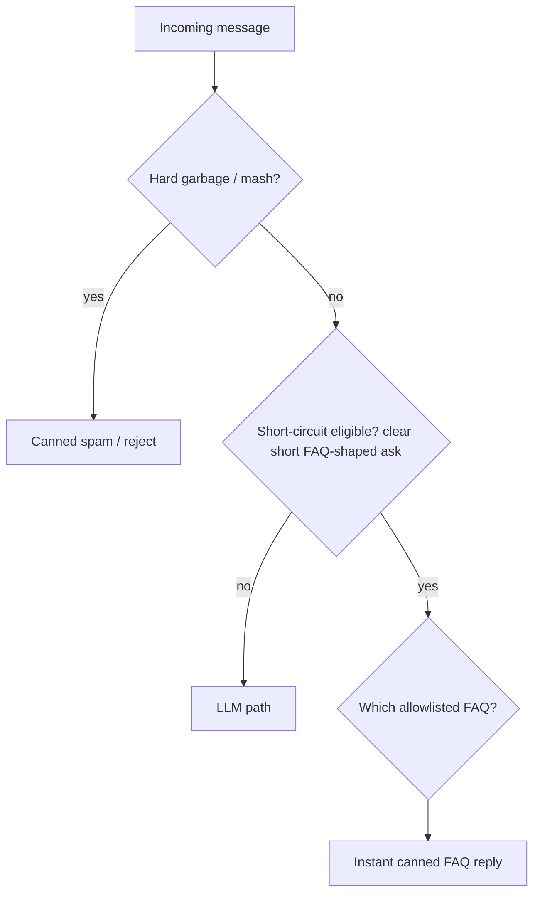

# Short-Circuit Router - Plan

## Goal Capsule

- **Objective:** Stop canned short-circuit replies from firing on role-share / job-description pastes while keeping instant, stable answers for clear FAQ-shaped asks and hard garbage filters.
- **Authority:** Confirmed Product Contract (ce-brainstorm 2026-07-17) > this Planning Contract.
- **Stop when:** `lib/input-filter.test.ts` covers AE1–AE6 and passes under `npm test`; JD pastes no longer return salary/work-arrangement canned reasons; short FAQ asks and mash still short-circuit; client and server continue to share one `filterInput` implementation.

---

## Product Contract

### Summary

Replace keyword-anywhere short-circuiting with a single router that defaults to the LLM: hard mash stays pattern-based; only clear, short FAQ-shaped asks get canned replies; longer / role-share messages (including JDs that bury compensation or contract language) go to the LLM. Prove behavior with TDD, then a short manual pass.

### Problem Frame

Recruiters paste full job descriptions into the portfolio chat. Those pastes often contain salary ranges, “contract,” “full-time,” and similar terms as employer copy—not as questions to Mikkel. Today’s short-circuits treat those substrings as FAQ asks, so visitors get canned compensation or work-arrangement replies instead of a role-fit conversation. Filters still matter for cost, wording consistency, and avoiding LLM latency on true FAQs and garbage; the failure is the trigger, not the existence of canned replies.

### Key Decisions

- **Keep short-circuits; fix triggers.** Instant canned FAQs remain valuable for speed, stable wording, and token cost—not only anti-abuse.
- **Single router, default to LLM.** One decision path: hard garbage → short-circuit eligibility → FAQ canned reply or LLM. No keyword match may fire without eligibility.
- **Heuristic routing only.** No second model call to classify intent; if a model would be invoked, answer with that call.
- **Role-share wins on long mixed messages.** A long paste that both shares a role and asks about terms still skips canned replies and goes to the LLM.
- **Hard mash stays pattern-based.** Keyboard mash / repeated-character garbage does not need FAQ eligibility.
- **FAQ topics are an allowlist.** New canned topics are added deliberately; accidental keyword hits are out.

### Actors

- A1. Recruiter / hiring visitor — pastes JDs or asks short FAQ questions in chat; needs correct path (LLM vs instant canned).
- A2. Site owner / maintainer — expects low false positives, preserved FAQ speed, and automated tests as the primary gate.

### Key Flows

- F1. Role-share / JD paste
  - **Trigger:** Visitor pastes a job description or other long role-share text that mentions compensation, contract, full-time, or similar employer copy.
  - **Actors:** A1
  - **Steps:** Router treats message as not short-circuit eligible → LLM answers about fit / opportunity (no compensation or work-arrangement canned reply).
  - **Outcome:** No false-positive canned FAQ.
  - **Covered by:** R1, R2, R5, AE1, AE2

- F2. Explicit short FAQ ask
  - **Trigger:** Visitor sends a clear, short question about an allowlisted topic (e.g. salary expectation, C2C/W2, greeting).
  - **Actors:** A1
  - **Steps:** Router marks eligible → matching canned FAQ returns immediately (no LLM round trip).
  - **Outcome:** Instant stable answer.
  - **Covered by:** R3, R4, AE3, AE4

- F3. Hard garbage
  - **Trigger:** Keyboard mash or repeated-character spam within the existing short-message spam regime.
  - **Actors:** A1
  - **Steps:** Pattern filter fires before FAQ eligibility; canned spam / reject path; no LLM.
  - **Outcome:** Garbage blocked without JD false positives.
  - **Covered by:** R6, AE5

### Requirements

**Routing**

- R1. Short-circuit canned FAQs fire only when the message is short-circuit eligible: a clear, short, FAQ-shaped ask—not because an allowlisted keyword appears anywhere in a longer role-share / JD body.
- R2. Messages that are role-share / JD-shaped (including long mixed messages that also mention terms) default to the LLM path and must not receive compensation or work-arrangement canned replies.
- R3. Clear, short asks for allowlisted FAQ topics still receive the existing style of instant canned replies (no LLM round trip).
- R4. Greeting / throwaway short messages that are FAQ-shaped may still short-circuit; they must not short-circuit merely because a greeting token appears inside a longer substantive message.
- R5. Client and server short-circuit behavior stay aligned so a message cannot get a canned reply on one path and an LLM reply on the other for the same eligibility rules.

**Garbage and allowlist**

- R6. Hard garbage detection (keyboard mash / repeated characters) remains pattern-based and independent of FAQ eligibility, without reintroducing JD false positives on long pastes.
- R7. FAQ canned topics are maintained as an intentional allowlist; adding a new canned topic is an explicit product change, not an accidental keyword expansion.

**Verification**

- R8. Behavior is specified and locked with automated tests written TDD-first; a short manual pass follows only after tests are green.

### Acceptance Examples

- AE1. Covers R1, R2.
  - **Given:** A pasted JD that includes a compensation / salary range section (as in the observed false-positive conversation).
  - **When:** The message is submitted to chat.
  - **Then:** The reply is not the compensation canned short-circuit; the LLM path is used.

- AE2. Covers R1, R2.
  - **Given:** The same JD with compensation removed but still containing work-culture / contract / full-time employer language.
  - **When:** The message is submitted.
  - **Then:** The reply is not the work-arrangement canned short-circuit; the LLM path is used.

- AE3. Covers R3.
  - **Given:** A short explicit ask such as “What’s his salary expectation?” or “Can he do C2C?”
  - **When:** The message is submitted.
  - **Then:** The matching canned FAQ returns immediately without an LLM round trip.

- AE4. Covers R4.
  - **Given:** A short greeting such as “hi”.
  - **When:** The message is submitted.
  - **Then:** The greeting short-circuit may fire; the same token inside a long JD does not by itself force a greeting canned reply.
  - **Note:** Today `"hi"` alone is length ≤10 and may reason as `too_short` before `generic_query`. Either reason is acceptable for AE4a as long as it is canned and not the LLM path.

- AE5. Covers R6.
  - **Given:** A short keyboard-mash / repeated-character spam message.
  - **When:** The message is submitted.
  - **Then:** The hard garbage path fires; a long legitimate JD is not treated as mash solely for containing repeated letters in normal prose.

- AE6. Covers R2 (mixed message).
  - **Given:** A long JD paste that also includes an explicit terms question in the same message.
  - **When:** The message is submitted.
  - **Then:** Role-share wins: no compensation / work-arrangement canned short-circuit; LLM path is used.

### Success Criteria

- Automated tests cover AE1–AE6 (or equivalent cases) and are the primary “working” signal.
- After tests are green, a short manual replay of the observed JD pastes and a couple true-positive FAQ asks confirms the same behavior in the UI.
- True FAQ asks remain noticeably faster than LLM replies (instant canned path preserved).

### Scope Boundaries

**In scope**

- Reshape short-circuit eligibility so JD / role-share pastes stop false-positive canned FAQs.
- Preserve instant canned replies for clear short FAQ asks and hard mash filtering.
- Align client and server short-circuit outcomes (shared module).
- TDD / automated coverage for false positives, true positives, greetings, mash, and mixed long messages.
- Apply the same eligibility gate to location and work-auth short-circuits (same false-positive class as salary / work arrangement).

**Deferred for later**

- Expanding or rewriting FAQ canned copy beyond what’s needed for eligibility correctness.
- A model-based intent classifier or any second LLM call used only to choose canned vs LLM.
- Unifying the duplicate JD detector in `app/api/lib/knowledge-base.ts` with the filter module (RAG load-all path; out of this fix).

**Outside this product's identity**

- Removing the short-circuit / filter layer entirely and folding all FAQ and garbage handling into the LLM.

### Assumptions

- Low traffic does not justify removing short-circuits; their value is latency, consistency, and cost on clear FAQs.
- “Intent” in product language means heuristic eligibility (length + FAQ-shaped ask vs role-share), not a classifier model.
- Existing JD-detection ideas in the codebase are uneven today; this plan replaces “JD enables filters” with “role-share / long paste vetoes FAQ short-circuits.”
- CE cutover / agent-workflow artifact churn is unrelated to app behavior and is not part of this change set beyond this plan file.

### Outstanding Questions

**Resolve Before Planning**

_(none)_

**Deferred to Planning** — resolved in Planning Contract

- Eligibility heuristics → see KTD-1.
- Test placement → see KTD-2 / Verification Contract.

### Sources / Research

- Observed false-positive chat: JD with compensation → salary canned; JD without compensation but with contract/full-time language → work-arrangement canned.
- Code: `lib/input-filter.ts` — work-arrangement and location ungated; salary patterns include `salary range` / `compensation range` with no JD skip; `filterJobCriteria` enters when JD **or** job-related (amplifies FPs); mash already skips length > 200; client `components/ChatInterface.tsx` and server `app/api/chat/route.ts` both call shared `filterInput`.
- Tests: Vitest via `npm test` includes `lib/**/*.test.ts`; ad-hoc `tests/test-job-filtering.ts` covers `filterJobCriteria` only and is not the CI gate.

---

## Planning Contract

### Key Technical Decisions

- **KTD-1. Eligibility = short FAQ-shaped ask; role-share / long paste is a hard veto.** Introduce an explicit eligibility check used before any FAQ canned matcher (salary, work arrangement, location, work auth, role mismatch, greeting/too-short when those are FAQ-class). Prefer: (a) hard veto when message looks like role-share / long paste (length threshold and/or structural JD signals and/or multi-section employer copy), and (b) allow canned only when the remaining message is short and ask-shaped. Do **not** keep today’s “JD or job-related ⇒ run salary/auth filters” entry gate.
- **KTD-2. Primary proof is Vitest on `filterInput`.** New `lib/input-filter.test.ts` (matches `vitest.config.ts` include). Port or supersede valuable cases from `tests/test-job-filtering.ts`; do not rely on the ad-hoc tsx script as the gate.
- **KTD-3. Reshape in the shared module only.** Client and server already import `lib/input-filter.ts`; R5 is satisfied by one implementation. Avoid forking heuristics in UI or route handlers; comment updates only if pipeline docs drift.
- **KTD-4. Pipeline order matches the product flowchart.** Evaluate hard garbage (too-short for empty noise, repeated chars, keyboard mash) before FAQ eligibility; then eligibility; then allowlisted FAQ matchers; default LLM. Today FAQ matchers run before mash — reorder so short mash cannot fall through to LLM via “ineligible,” and long JD cannot hit FAQ before the veto.
- **KTD-5. Tighten salary / work-arrangement patterns under the allowlist.** Remove or constrain patterns that match employer copy (`salary range`, `compensation range`, bare `full-time` / `contract` in long bodies). True positives must be ask-shaped and short enough to pass eligibility (e.g. expectation / C2C / W2 questions).
- **KTD-6. Leave knowledge-base JD detector alone.** Duplicate `isJobDescriptionQuery` in `app/api/lib/knowledge-base.ts` is RAG-only; unifying is deferred.

### High-Level Technical Design

Directional only — implementer owns exact helpers and thresholds.

1. **Hard garbage first** on trimmed input (preserve existing ≤200 mash gates).
2. **`isShortCircuitEligible(message)`** (name flexible): false for role-share / long pastes (AE1/AE2/AE6); true only for clear short FAQ-shaped asks.
3. **If ineligible → `{ shouldCallAPI: true }`** (no FAQ canned reasons).
4. **If eligible → run allowlisted FAQ detectors** (salary, arrangement, location, auth, role, greeting/generic) with tightened ask-shaped patterns; return canned on first match.
5. **Default → LLM.**

### Alternatives Considered

- **LLM intent classifier on long messages** — rejected (extra latency/cost; if calling a model, just answer).
- **Remove all filters** — rejected (loses instant FAQ UX and stable wording).
- **Bolt JD skip only onto work-arrangement** — rejected (salary/location/auth share the same FP class; product chose a single router).

### Assumptions

- A length + structural/role-share veto is sufficient without a model call; if unstructured medium blurbs still FP after U1–U3, tighten veto heuristics in-unit rather than adding a classifier.
- Existing canned response copy strings can stay; this work is trigger logic.
- Follow-up short replies after a `?` in history can remain as today’s special case if they still default to LLM when appropriate; do not let them reintroduce keyword-anywhere FAQ on long bodies.

### Execution Order

1. U1 — TDD red: AE1/AE2/AE6 fixtures asserting `filterInput` → LLM path.
2. U2 — Eligibility gate + pipeline reorder (mash → eligible → FAQ).
3. U3 — Tighten / gate salary + work-arrangement (+ location/auth) behind eligibility; green AE1–AE6 and true positives.
4. U4 — Port regressions from ad-hoc job-filtering script; confirm `npm test` green; optional comment sync at call sites.

---

## Implementation Units

### U1. Red tests for JD false positives and mixed messages

- **Goal:** Lock AE1, AE2, and AE6 as failing Vitest cases against current `filterInput` behavior before changing production logic.
- **Files:** `lib/input-filter.test.ts` (create); fixtures inline or local constants; read `lib/input-filter.ts` for current `reason` strings.
- **Patterns:** Vitest `describe`/`it`/`expect`; assert `shouldCallAPI === true` and `reason` not in `{ salary_query, work_arrangement_query }` for FP cases.
- **Test scenarios:**
  - AE1 fixture: long JD with compensation / salary range section → must call API (expect fail on current code).
  - AE2 fixture: same JD without compensation, with full-time/contract language → must call API (expect fail on current code).
  - AE6 fixture: long JD + embedded/trailing explicit salary or C2C question → must call API (role-share wins).
- **Verification:** `npm test` runs the new file; U1 complete when tests exist and correctly fail (or skip-marked only if harness requires green main — prefer committed red-then-green within the branch).

### U2. Short-circuit eligibility gate and pipeline reorder

- **Goal:** Implement hard-garbage-first routing and `isShortCircuitEligible` (or equivalent) so ineligible messages never reach FAQ canned matchers.
- **Files:** `lib/input-filter.ts`; continue `lib/input-filter.test.ts`.
- **Patterns:** Follow existing `FilterResult` / reason codes; prefer small pure helpers over duplicating JD logic into call sites; do not edit `app/api/lib/knowledge-base.ts`.
- **Dependencies:** U1 fixtures available.
- **Test scenarios:**
  - After gate: AE1/AE2/AE6 pass (LLM path).
  - Short mash still canned (`keyboard_mash` / `repeated_chars`) with length ≤200 behavior preserved (AE5).
  - Long JD with double letters in normal words is not mash (AE5b).
  - Ineligible messages never return FAQ canned reasons even if keywords match.
- **Verification:** `npm test` — AE1/AE2/AE5/AE6 green for routing structure (FAQ true positives may still be incomplete until U3).

### U3. Allowlisted FAQ matchers under eligibility

- **Goal:** Preserve instant canned replies for clear short FAQ asks; tighten patterns so employer copy cannot match when somehow still eligible; apply same eligibility to location and work-auth.
- **Files:** `lib/input-filter.ts`; `lib/input-filter.test.ts`.
- **Patterns:** Keep existing canned message copy; change triggers. Salary: prefer ask-shaped (expectation, directed questions) over bare `salary range` / `compensation range` in long text. Work arrangement: require ask-shaped / short eligible context rather than bare `contract`/`full-time` anywhere.
- **Dependencies:** U2.
- **Test scenarios:**
  - AE3a: short “What’s his/your salary expectation?” → `shouldCallAPI === false`, `reason: salary_query`.
  - AE3b: short “Can he do C2C?” / W2 ask → `work_arrangement_query`.
  - AE4a: `"hi"` / `"hello"` → canned (`too_short` or `generic_query` acceptable).
  - AE4b: long JD containing substring `hi` → LLM path.
  - Optional regression: short location / work-auth asks still canned; JD with “based in” / “authorized to work” → LLM.
- **Verification:** Full AE1–AE6 green under `npm test`.

### U4. Regressions and call-site sanity

- **Goal:** Preserve valuable `filterJobCriteria` cases (SE JD proceed, role mismatch doctor/teacher, auth short asks) in Vitest; confirm shared module keeps client/server aligned without dual edits.
- **Files:** `lib/input-filter.test.ts`; optionally thin `tests/test-job-filtering.ts` (point to Vitest or leave unused); comments only in `components/ChatInterface.tsx` / `app/api/chat/route.ts` if pipeline description is wrong.
- **Dependencies:** U3.
- **Test scenarios:**
  - Port: SE-oriented JD without compensation proceeds; non-SE role JD declines; short auth ask canned.
  - Smoke: importing `filterInput` from both documented paths remains the same module (no code fork).
- **Verification:** `npm test` green; no behavior change required in React/route files unless comments are stale.

---

## Verification Contract

| Command | Applicability | Units |
|---------|---------------|-------|
| `npm test` | Primary gate — must be green before manual UI pass | U1–U4 |
| Manual chat replay of observed JD pastes + short FAQ asks | After Vitest green; owner smoke only | Product R8 |
| `npm run test:e2e` | Optional; not required for this fix unless chat E2E breaks | — |

---

## Definition of Done

- [ ] `artifact_readiness: implementation-ready` plan executed on branch `fix/short-circuit-router`
- [ ] AE1–AE6 covered in `lib/input-filter.test.ts` and passing via `npm test`
- [ ] JD / role-share pastes do not return `salary_query` or `work_arrangement_query`
- [ ] Short FAQ asks and short mash still short-circuit
- [ ] No second LLM/classifier for intent; no changes to knowledge-base JD detector required
- [ ] Client and server still share `lib/input-filter.ts` with identical eligibility rules
- [ ] Manual smoke after green tests (owner)
