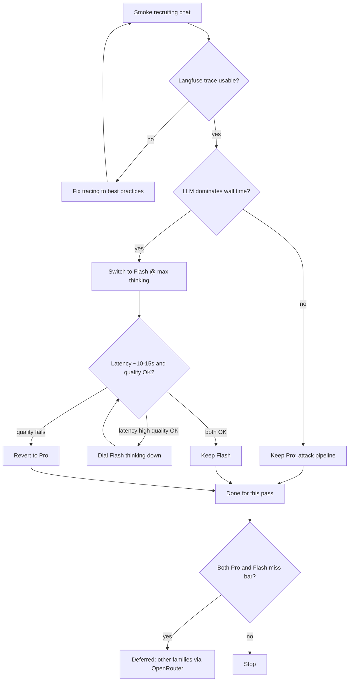

# Chat Latency Measure-then-Branch - Plan

## Goal Capsule

- **Objective:** Get trustworthy chat latency attribution via Langfuse, then either fix non-LLM pipeline cost (keep DeepSeek Pro) or move to DeepSeek Flash with a thinking dial and quality gate so normal recruiting replies land around 10–15s without sacrificing synthesis quality.
- **Authority:** Confirmed Product Contract (ce-brainstorm 2026-07-17) > this Planning Contract.
- **Product Contract preservation:** unchanged (R/A/F/AE IDs preserved).
- **Stop when:** U1–U3 land with tests green under `npm test`; a smoke run can produce an inspectable Langfuse trace (or documented env checklist proves why not); step timings attribute LLM vs pipeline; DeepSeek Flash + dialable thinking (`max` → `high` → disabled) is env-configurable without code edits; maintainer playbook for measure → branch → quality gate is in the plan Appendix; no OpenRouter or LLM-as-judge work.

---

## Product Contract

### Summary

Unblock Langfuse tracing to best practices, measure where the ~30s smoke spend goes, then branch: attack the pipeline if non-LLM work dominates; otherwise switch to DeepSeek Flash (thinking started high/max, dialed down to the latency band) and keep the change only if answer quality holds versus Pro.

### Problem Frame

After adopting DeepSeek v4 Pro, a recruiting-chat smoke run takes ~30s wall-clock with no timing breakdown. Thinking overhead is the leading hypothesis, but traces are not showing up after keys were added, so the bottleneck is unverified. Flash is attractive for speed, yet smaller/faster models have previously failed to synthesize knowledge-base context well enough for this product. Pro is already at its lowest usable reasoning setting, so further Pro dial-down is not available.

### Key Decisions

- **Measure before changing the default model.** Langfuse must produce a usable timing picture of a real smoke run before Flash or pipeline changes are treated as proven fixes.
- **Branch on attribution.** LLM-dominant → Flash ladder; non-LLM-dominant → keep Pro and attack pipeline cost only.
- **Flash thinking ladder.** Start Flash with thinking at max (or highest available), then dial thinking down until end-to-end latency is about 10–15s, re-checking quality after each dial.
- **Manual quality gate with revert.** Compare Flash answers to Pro on the same smoke prompts; revert to Pro if synthesis quality regresses. No LLM-as-judge in this scope.
- **OpenRouter family switch is deferred.** Only if both Pro (after any pipeline fix) and Flash (after thinking dial + quality gate) miss the bar.

### Actors

- A1. Site owner / maintainer — runs smoke tests, reads Langfuse, decides keep/revert.
- A2. Recruiter / hiring visitor — experiences chat latency and answer quality on the live path.

### Key Flows

- F1. Attribution smoke
  - **Trigger:** Maintainer sends a representative recruiting/chat smoke prompt after Langfuse keys are configured.
  - **Actors:** A1
  - **Steps:** Request completes; Langfuse shows a trace that attributes time enough to decide LLM vs pipeline dominance.
  - **Outcome:** Branch decision is evidence-based, not guessed.
- F2. Pipeline branch
  - **Trigger:** Trace shows non-LLM work dominates the ~30s.
  - **Actors:** A1 (A2 benefits)
  - **Steps:** Keep Pro; reduce the expensive non-LLM path until latency is acceptable or the remaining cost is known to be elsewhere.
  - **Outcome:** No model switch solely for speed.
- F3. Flash ladder branch
  - **Trigger:** Trace shows the LLM call dominates.
  - **Actors:** A1 (A2 benefits)
  - **Steps:** Switch to Flash at max thinking; if latency still exceeds ~10–15s with good quality, dial thinking down and re-check; keep only if quality holds vs Pro; otherwise revert.
  - **Outcome:** Default model is Flash only when both latency band and quality gate pass.

### Requirements

**Observability**

- R1. A local (or otherwise configured) smoke run against the chat path produces a Langfuse trace the maintainer can open and use to attribute latency.
- R2. Tracing setup follows Langfuse best practices for this app’s existing instrumentation (use the installed Langfuse skill during implementation/planning).
- R3. Attribution is good enough to decide whether the LLM call dominates end-to-end wall time versus other chat-path work.

**Latency outcome**

- R4. After the chosen branch, a normal recruiting chat reply targets roughly 10–15 seconds end-to-end wall-clock.
- R5. If the LLM does not dominate, Pro remains the model; work targets the non-LLM cost instead of switching to Flash.

**Flash branch (only if LLM-dominant)**

- R6. Flash is introduced with thinking enabled at the highest available setting first.
- R7. If latency remains above the ~10–15s band while quality is acceptable, thinking is dialed down stepwise until the band is met, then quality is re-checked.
- R8. Flash is kept as the default only if smoke answers remain acceptably close to Pro quality on the same prompts; otherwise the default reverts to Pro.

### Scope Boundaries

**In scope**

- Unblocking and validating Langfuse traces for chat latency attribution
- Evidence-based branch: pipeline fix (keep Pro) or Flash ladder (max → dial → quality gate)
- Documenting OpenRouter / other-family switch as the next option if both fail

**Deferred for later**

- LLM-as-judge / automated quality scoring (larger blast radius)
- OpenRouter discounted Google / OpenAI family switch
- Streaming or other perceived-latency UX as the primary fix
- Mid-tier DeepSeek (none available for this product choice)

**Outside this pass**

- Changing short-circuit FAQ behavior as a latency strategy (separate plan)
- Broad multi-provider quality bakeoffs beyond the Pro vs Flash decision tree above

### Acceptance Examples

- AE1. Trace visible
  - **Covers:** R1, R2
  - **Given:** Langfuse keys are set and the app is run in the environment under test
  - **When:** Maintainer sends the smoke prompt
  - **Then:** A Langfuse trace for that request appears and is inspectable
- AE2. Attribution decides branch
  - **Covers:** R3, R5
  - **Given:** A usable trace from AE1
  - **When:** Maintainer compares LLM time to the rest of the request
  - **Then:** They can state whether the LLM dominates; if not, Pro stays and work targets pipeline cost
- AE3. Flash keep
  - **Covers:** R4, R6, R7, R8
  - **Given:** LLM-dominant attribution
  - **When:** Flash is tried at max thinking, dialed if needed, and compared to Pro on the same smokes
  - **Then:** Default becomes Flash only if ~10–15s and quality hold; otherwise Pro is restored
- AE4. Both miss → deferred path named
  - **Covers:** Scope Boundaries (deferred OpenRouter)
  - **Given:** Pipeline-fixed Pro and Flash ladder both miss latency or quality
  - **When:** This pass concludes
  - **Then:** Next option is other model families via OpenRouter; not implemented in this pass

### Assumptions

- “Quality holds” means maintainer judgment on the same smoke prompts versus Pro, not an automated scorer.
- DeepSeek Flash exposes a thinking / reasoning control comparable to Pro’s (start high/max, then dial down). Exact control names are a planning concern.
- Current Pro reasoning is already at the lowest setting the product will use; further Pro dial-down is out of scope.
- Repo already has Langfuse prompt + tracing hooks; the gap is making traces reliably appear and be useful for attribution (keys were added but the last run did not show a trace).

### Dependencies

- Langfuse project API keys and base URL correctly loaded in the environment under test
- Installed Langfuse agent skill at `.agents/skills/langfuse` for best-practice guidance during planning/implementation
- DeepSeek API access to a Flash variant when the LLM-dominant branch is taken

### Sources / Research

- Grounding dossier: `/tmp/compound-engineering/ce-brainstorm/latency-deepseek/grounding.md` (session scratch; quotes `llm.ts`, `instrumentation.ts`, chat route).
- DeepSeek V4 docs: model ids `deepseek-v4-pro` / `deepseek-v4-flash`; thinking via `extra_body.thinking`; `reasoning_effort` is `high` | `max` only (`low`/`medium` map to `high`).
- Langfuse skill: `.agents/skills/langfuse` — baseline requirements include span hierarchy, generation types, flush/audit loop.

---

## Planning Contract

### Key Technical Decisions

- **KTD-1. Treat missing traces as a config + flush problem first.** Gates today: `LANGFUSE_TRACING` must be exactly `"true"` (`instrumentation.ts`, `langfuse.ts`); keys required; Node runtime only (edge returns early). Manual `traceLLMCall` is fire-and-forget after the LLM returns — serverless exit can drop unflushed spans. Fix path: ensure env checklist, await/flush before response return (or `waitUntil`-style), and prefer a parent chat-request observation with nested steps per Langfuse baseline (span hierarchy).
- **KTD-2. Dual attribution: Langfuse spans + explicit step timings.** LLM-only `duration_ms` is insufficient for R3. Time filter → KB → prompt build → LLM in `app/api/chat/route.ts`, attach timings to the parent observation metadata and/or structured server logs. Do not rely on Langfuse UI alone for the branch decision.
- **KTD-3. Flash model id is `deepseek-v4-flash`; thinking dial is env-driven.** Wire `AI_MODEL` / fallbacks as today. Add `DEEPSEEK_REASONING_EFFORT` with allowed values `max` | `high` | `disabled` (map disabled → `thinking: { type: 'disabled' }`; otherwise enabled + effort). Default remains current Pro behavior until the maintainer flips env after measurement. Do **not** hardcode a permanent Flash default in this PR without attribution evidence.
- **KTD-4. “Dial down” ladder for V4 is `max` → `high` → `disabled`.** Product “lowest reasoning on Pro” matches code’s hardcoded `high` (thinking floor). There is no mid-tier between Pro and Flash; OpenRouter stays deferred.
- **KTD-5. Pipeline attack is conditional unit U4.** Execute only when step timings show non-LLM dominance. First suspects: JD “load everything” KB path (`knowledge-base.ts`), Langfuse prompt remote fetch (`langfuse-prompts.ts`). Prefer measured cuts over speculative slimming.
- **KTD-6. Quality gate stays manual; code ships the dial, not the judge.** Appendix playbook covers smoke prompts, env flips, keep/revert. No LLM-as-judge.

### High-Level Technical Design

Directional only — implementer owns exact helpers.

1. **Observability path:** Audit env → parent `chat_request` observation wrapping route steps → nested generation for LLM → flush/await before JSON response when tracing enabled.
2. **Attribution path:** `timings_ms: { filter, knowledgeBase, prompt, llm, total }` on metadata/logs (and optionally response field when `NODE_ENV=development` or a debug flag — avoid leaking in production unless already patterned).
3. **Model path:** `callDeepseek` reads effort from env/options; cost map includes `deepseek-v4-flash`; fallback chain accepts Flash via `AI_MODEL` / `AI_MODEL_FALLBACKS`.
4. **Maintainer branch:** After U1–U2 smoke, either set `AI_MODEL=deepseek-v4-flash` + `DEEPSEEK_REASONING_EFFORT=max` and dial, or run U4 pipeline cuts while leaving Pro.

### Alternatives Considered

- **Speculative Flash switch before traces** — rejected (Product Contract: measure first).
- **Streaming for perceived latency** — deferred (not primary fix).
- **Only Langfuse OTel without route timings** — rejected (today’s LLM-only duration cannot prove pipeline share).
- **LLM-as-judge quality gate** — deferred (blast radius).

### Assumptions

- `LANGFUSE_TRACING=true` may have been unset when keys were added — implementer verifies without printing secrets.
- DeepSeek V4 `reasoning_effort` values are only `high`/`max` for thinking mode; dial-down after `high` means disabling thinking.
- Product assumption “Pro at lowest” aligns with `high` (not `max`); code currently hardcodes `high`.
- Flipping production `AI_MODEL` to Flash is a maintainer env change after AE2/AE3, not a forced code default in this change set.
- U4 may no-op in the PR if attribution cannot be run in CI (no live keys); then U4 becomes a documented follow-up triggered by smoke evidence.

### Open Questions

**Resolve Before Planning**

_(none)_

**Deferred to Implementation**

- Exact flush API for `@langfuse/otel` / `LangfuseSpanProcessor` in Next.js Node runtime (await generation + `forceFlush` vs response `waitUntil`).
- Whether development-only response `timings` field is acceptable vs logs-only.

### Execution Order

1. U1 — Unblock and harden Langfuse chat traces  
2. U2 — Per-step route timings for attribution  
3. U3 — DeepSeek Flash + dialable reasoning effort  
4. U4 — Conditional pipeline cost cuts (only if non-LLM dominant)  
5. Maintainer playbook smoke (Appendix) — env branch / quality gate outside automated CI when keys absent  

---

## Implementation Units

### U1. Unblock and harden Langfuse chat traces

- **Goal:** A configured smoke run produces an inspectable Langfuse trace for `/api/chat` (R1, R2, AE1).
- **Files:** `instrumentation.ts`, `app/api/lib/langfuse.ts`, `app/api/chat/route.ts`, `ARCHITECTURE.md` (env checklist only if needed), `app/api/lib/__tests__/langfuse.test.ts` (new)
- **Patterns:** Existing `traceLLMCall` + `LangfuseSpanProcessor`; Langfuse skill baseline (span hierarchy, generation type, meaningful I/O); never block user-visible errors on trace failure.
- **Test scenarios:**
  - **Happy path:** With `LANGFUSE_TRACING=true` and keys mocked, `traceLLMCall` invokes observation update path (mock `@langfuse/tracing`).
  - **Edge case:** `LANGFUSE_TRACING` unset or not exactly `"true"` → no-op, no throw.
  - **Edge case:** Missing keys → no-op, no throw.
  - **Integration note:** Manual AE1 smoke remains the proof traces appear in the Langfuse UI (CI cannot own cloud UI).
- **Verification:** `npm test` covers new unit tests; manual smoke documents AE1 when keys available.
- **Done when:** Fire-and-forget drop risk is addressed for serverless (await/flush on traced path); parent/child observation shape matches skill baseline enough for R2; env prerequisites documented for the maintainer.

### U2. Per-step chat route timings

- **Goal:** Maintainer can decide LLM vs pipeline dominance from one request (R3, AE2).
- **Files:** `app/api/chat/route.ts`, optionally thin helper under `app/api/lib/` (e.g. timing util), `app/api/lib/langfuse.ts` (attach metadata), `app/api/lib/__tests__/chat-timings.test.ts` or route-level unit if patterned
- **Patterns:** Time steps already named in route comments (filter, KB, prompt, LLM); attach `timings_ms` to Langfuse parent metadata; structured `console` log acceptable as backup.
- **Test scenarios:**
  - **Happy path:** Helper accumulates step durations and total ≥ sum of parts (allow clock skew tolerance).
  - **Edge case:** Filtered short-circuit path records filter timing and skips LLM timing (or marks llm null).
  - **Error path:** Timing still recorded when LLM throws (if route catch allows).
- **Verification:** Unit tests for timing helper; manual smoke compares `llm` vs `total` for AE2.
- **Done when:** One smoke yields enough numbers to choose F2 vs F3 without guessing.

### U3. DeepSeek Flash + dialable reasoning effort

- **Goal:** Env can select `deepseek-v4-flash` and dial thinking `max` → `high` → `disabled` without further code changes (R6, R7 readiness; AE3 enablement).
- **Files:** `app/api/lib/llm.ts`, `app/api/lib/llm-fallback-chain.ts` (if needed for cost/detection), `ARCHITECTURE.md` env docs, `app/api/lib/__tests__/llm-deepseek-reasoning.test.ts` (new) and/or extend `llm-fallback-chain.test.ts`
- **Patterns:** Keep OpenAI-compat DeepSeek client; replace hardcoded `reasoning_effort: 'high'` with options/env; document `DEEPSEEK_REASONING_EFFORT`; add Flash to cost map; do not change default `AI_MODEL` in committed `.env` examples to Flash unless evidence already exists in-session.
- **Test scenarios:**
  - **Happy path:** Effort `max` / `high` → request includes thinking enabled + matching `reasoning_effort` (assert via mocked client create args).
  - **Happy path:** Effort `disabled` → thinking disabled; no reliance on unsupported mid values.
  - **Edge case:** Invalid env value → safe default (`high`) + warning log.
  - **Edge case:** `detectProvider('deepseek-v4-flash')` → `deepseek`.
- **Verification:** `npm test` green for new cases.
- **Done when:** Maintainer can run Flash ladder via env alone per Appendix.

### U4. Conditional pipeline cost cuts

- **Goal:** If U2 shows non-LLM dominance, reduce that cost while keeping Pro (R5, F2).
- **Files:** Likely `app/api/lib/knowledge-base.ts`, `app/api/lib/langfuse-prompts.ts`, and/or `app/api/chat/route.ts` — only files justified by measured hotspots
- **Patterns:** Prefer caching prompt fetch, narrowing JD “load everything” when safe, avoiding duplicate work — no speculative rewrites without timing evidence.
- **Test scenarios:**
  - **Happy path:** Whatever cut is chosen preserves existing KB/prompt unit behavior for non-JD queries (add/adjust tests in the touched module).
  - **Edge case:** JD / role-share still gets adequate context for synthesis quality (characterization or existing tests).
- **Verification:** `npm test`; before/after step timings on the same smoke prompt.
- **Done when:** Either (a) measured non-LLM ms drops meaningfully, or (b) unit skipped with written note that attribution showed LLM-dominant / smoke unavailable — then Flash ladder (U3 + Appendix) is the path.

---

## Verification Contract

| Gate | Command / action | Applies to |
|---|---|---|
| Unit tests | `npm test` | U1–U4 |
| Lint on edited files | IDE/`ReadLints` during implement | All |
| Manual AE1 | Smoke `/api/chat` with keys + `LANGFUSE_TRACING=true`; open Langfuse UI | U1 |
| Manual AE2 | Compare step timings / trace spans for LLM share | U2 |
| Manual AE3 | Env Flash ladder + quality judgment vs Pro | U3 (+ Appendix) |
| E2E | Do not require Playwright chat success for this plan (`e2e` stubs `/api/chat`) | — |

---

## Definition of Done

- [ ] U1–U3 merged with tests green
- [ ] U4 completed or explicitly skipped with attribution reason recorded in PR/plan note
- [ ] `ARCHITECTURE.md` env vars document `LANGFUSE_TRACING`, Flash model id, and `DEEPSEEK_REASONING_EFFORT`
- [ ] Appendix playbook is accurate for maintainer measure → branch → dial → keep/revert
- [ ] No OpenRouter / LLM-as-judge / streaming primary-fix work included
- [ ] Product Contract R-IDs remain satisfied or consciously deferred only where marked (R4/R8 ultimately need maintainer smoke)

---

## Appendix

### Maintainer playbook (measure → branch)

1. Confirm `.env.local`: `LANGFUSE_PUBLIC_KEY`, `LANGFUSE_SECRET_KEY`, `LANGFUSE_BASE_URL` (cloud region), `LANGFUSE_TRACING=true`. Restart `npm run dev`.
2. Send a representative recruiting smoke (prefer LLM path: role-share / non-FAQ).
3. Open Langfuse traces; confirm AE1. Read `timings_ms` / spans for AE2.
4. **If non-LLM dominates:** keep `AI_MODEL` on Pro; pursue U4 cuts; re-smoke.
5. **If LLM dominates:** set `AI_MODEL=deepseek-v4-flash` and `DEEPSEEK_REASONING_EFFORT=max`; smoke for latency + quality vs Pro.
6. If latency > ~10–15s and quality OK → set effort `high`, re-smoke; if still high → `disabled`, re-smoke; stop when band hit or quality fails.
7. Quality fail at any rung → revert `AI_MODEL` to Pro (and prior effort).
8. If both Pro (post-U4) and Flash ladder miss → deferred OpenRouter family switch (out of scope).
